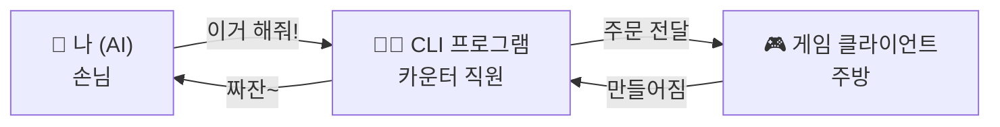
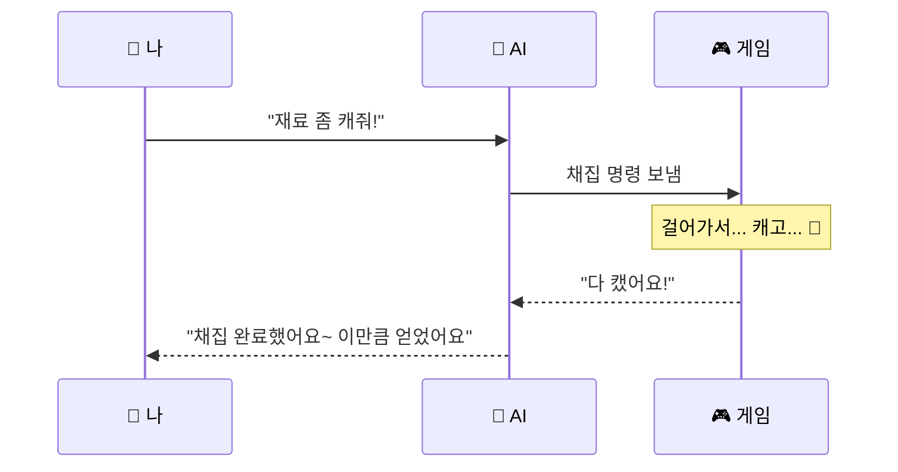
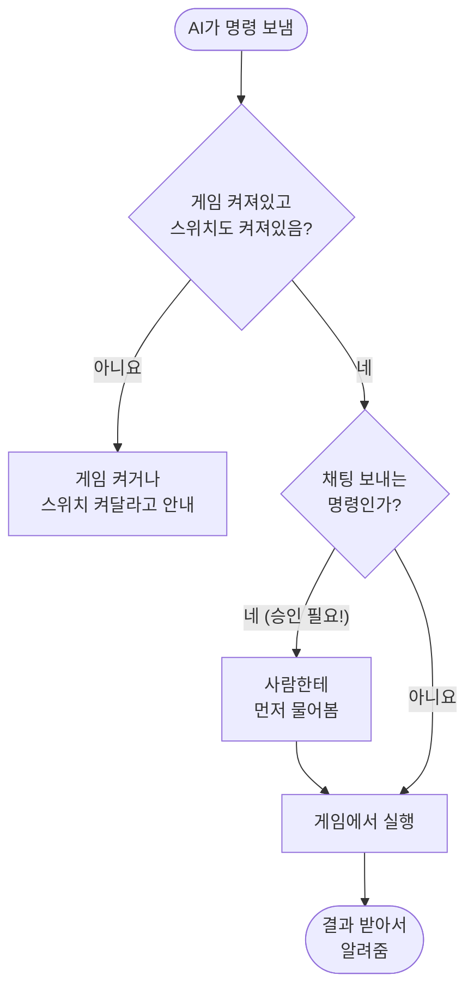

# 마비노기 모바일 AI 커넥터, 이게 뭔데? 🎮🤖

> 완전 쉽게 풀어쓴 버전! 게임은 잘 알지만 개발 용어는 몰라도 다 이해되게 썼어요.

---

## 1. 한 줄 요약

**"AI한테 내 캐릭터 조종을 잠깐 맡길 수 있게 됐다"** — 이게 끝이에요.

마비노기 모바일이 업데이트되면서, 게임 안에 설정 하나가 생겼어요.
"MM AI 에이전트 활성화"라는 스위치를 켜면, 그때부터 AI(예: Claude)가
내 캐릭터한테 "야, 지금 뭐 들고 있어?", "이거 채집해줘" 같은 걸
직접 물어보고 시킬 수 있어요.

**전제조건 딱 2개:**
1. 게임이 켜져 있어야 함
2. 게임 설정에서 그 스위치가 ON 상태여야 함

옵션이 꺼져 있거나 게임 연결이 끊기면 어떤 명령도 실행되지 않아요. 옵션의
자동 해제 주기는 게임 명령 스키마에 나오지 않으니, 문제가 생길 때 설정을 직접
확인하면 됩니다.

---

## 2. 어떻게 작동하는 거야? (그림으로 설명)

### 2.1 제일 쉬운 비유

카페에서 주문하는 걸 떠올려보세요 ☕

- **나(AI)** = 손님
- **CLI 프로그램** = 카운터 직원 (주문 받아서 주방에 전달)
- **게임** = 주방 (실제로 음식 = 게임 행동을 만드는 곳)

내가 "아메리카노 주세요" 라고 하면 → 직원이 주방에 전달 → 주방에서 만듦 →
직원이 다시 갖다줌. AI 커넥터도 똑같아요. AI가 "채집해줘" 하면 → CLI가
게임한테 전달 → 게임이 실제로 캐릭터를 움직여서 채집함 → 결과를 다시 AI한테 줌.



### 2.2 왜 시간이 좀 걸려?

채집이나 제작을 시키면, 캐릭터가 실제로 그 자리까지 걸어가야 하잖아요?
그거 다 시간이 걸려요. 그래서 AI가 "채집해줘" 하면, **캐릭터가 진짜로
다 끝낼 때까지 AI도 같이 기다려요.** 중간에 재촉하지 않는 편이 좋아요.
이동·상태·사용자 취소 때문에 작업이 중단될 수도 있고, 그 이유는 게임 응답으로
확인할 수 있어요.



### 2.3 명령 하나가 처리되는 과정 (간단 버전)



**핵심 포인트:** 채팅 보내는 것만큼은 AI가 마음대로 못 보내요. 꼭 사람한테
"이거 보내도 돼요?" 하고 물어본 다음에만 보낼 수 있어요. 나머지(정보 조회, 채집,
제작 등)는 바로바로 할 수 있어요.

---

## 3. 그래서 AI가 뭘 할 수 있는데?

2026-09-20에 게임에서 읽은 목록 기준으로, 실제 게임 기능은 **27가지**예요.
별도로 명령 목록 자체를 새로 읽는 `capabilities` 명령까지 세면 CLI 명령은
28가지입니다. 크게 6개 종류로 나눠볼게요.

### 3.1 "정보만 알려줘" 계열 (그냥 물어보기, 아무것도 안 건드림)

| 뭐가 궁금할 때 | 실제 조회 범위 |
|---|---|
| 내 캐릭터 스탯, 체력, 배고픔 | 캐릭터 정보 조회 |
| 지금 어디 있는지, 날씨, 시간 | 위치/환경 조회 |
| 지금 뭐 하는 중인지 (전투중? 이동중?) | 활동 상태 조회 |
| 퀘스트 뭐 남았는지 | 퀘스트 조회 |
| 돈/재화 얼마 있는지 | 재화 조회 |
| 오늘/이번주 미션 뭐 남았는지 | 일일/주간 미션 조회 |
| 가방 무게 | 인벤토리 조회 |
| 갖고 있는 아이템들 | 아이템 목록 조회 |
| 주변에 누구 있는지(NPC, 다른 유저) | 주변 조회 |
| 악보·악기·표정·행동 뭐 갖고 있는지 | 음악/소셜 관련 조회 |
| 채집/제작/변형 뭐가 가능한지와 진행 상태 | 각각 조회 |

→ 이 계열은 **완전 안전**해요. 그냥 물어보는 거라 게임에 아무 영향 없어요.

### 3.2 "채팅 보내줘" (⚠ 꼭 물어보고 보냄)

채팅 메시지 보내기, 또는 춤 같은 행동/표정 실행. **이것만큼은 AI가
매번 "이 내용 보내도 될까요?" 하고 확인받은 다음에 보내요.** 일반 대사는
50자 제한이고, 채널을 지정하거나 길드 채널로 강제 전송하는 옵션은 없어요.
`/지역`, `/파티`처럼 채널을 바꾸는 특수 명령은 거부돼요.

현재 게임이 제공하는 행동은 104개, 표정은 25개예요. 예를 들어
`/전통댄스`, `/ㅇㅅ`, `/엄지척`, `/미안` 같은 행동과 😁, 😉, 🥳 같은 표정을
실행할 수 있어요. 이 목록은 게임 업데이트에 따라 바뀔 수 있습니다.

### 3.3 "채집해줘"

이름으로 지정한 재료를 한 번 실행할 때 게임이 정한 목표까지 채집해요
(최대 100개). 명령 입력에 원하는 수량을 넣는 칸은 없어서, 100개를 넘는
목표는 완료 응답을 확인하며 여러 번 호출해야 해요. 낚시류는 자동낚시를
켜주는 식으로 작동하고, 멈출 때는 별도의 중지 명령을 써야 해요.
**실행마다 "정령의 날개" 5개가 들어가요.**

### 3.4 "만들어줘" (제작 / 변형·연금)

- **제작**: 레시피대로 아이템 만들기. 이동부터 완성·결과 수령까지 한 번에 해요.
- **변형(연금)**: 이건 좀 달라요 — "만들어줘" 하면 바로 만들어지는 게 아니라
  **작업대에 올려놓고 시간이 지나야 완성**돼요. 그래서 "완성됐나 확인해줘" →
  "완성된 거 수거해줘" 이렇게 두 단계로 나뉘어요.
- 둘 다 **정령의 날개 5개**씩 들어가요. 제작의 `craftCount`는 결과 아이템
  개수가 아니라 제작 횟수예요.

### 3.5 "연주해줘"

갖고 있는 악보 중 골라서 연주 시작! 악기를 먼저 장착해야 되고,
전투 중이거나 탈것 타고 있으면 못 해요.

### 3.6 "멈춰줘"

연주, 자동사냥, 채집 같은 거 하다가 멈추고 싶을 때. 앉아있는 상태에서
"일어나기"는 따로 명령이 있어요 (멈춰줘로는 안 먹혀요).

---

## 4. 이것만은 꼭 알아두기 🚨

### 4.1 채팅은 무조건 먼저 물어봄

AI가 절대 마음대로 채팅 안 쏴요. 무조건 "이 내용 보낼까요?" 확인부터.

### 4.2 돈(정령의 날개) 부족하면 안 됨

채집·제작·변형 할 때마다 정령의 날개 5개씩 나가요. 부족하면 그냥 안 되고
"얼마 부족해요"라고 알려줘요. 이 재화는 일일 미션 하면 모을 수 있어요.

### 4.3 오래 걸리는 건 원래 그런 거예요

채집/제작처럼 캐릭터가 진짜로 움직여야 하는 건 시간이 걸려요.
그동안 AI가 기다리는 게 정상이니 "왜 이렇게 오래 걸려" 하고 불안해할 필요 없어요.
중단되면 `blocked`, `timeout`, `canceled`, 도구 파손 같은 응답 이유를 먼저 확인하세요.

### 4.4 한글 쓸 때 살짝 번거로움 있음

컴퓨터 프로그램 내부적으로 한글이 가끔 깨질 수 있어서, 특별한 방식(암호처럼
변환해서 보내는 것)으로 감싸서 보내야 해요. 그리고 결과를 받을 때도 한글이
이상한 코드(`\uXXXX` 같은 것)로 보일 때가 있는데, 이건 깨진 게 아니라
그냥 암호화된 표현이라 프로그램이 알아서 다시 한글로 풀어줘요.

> 실제로 이 조사하면서 "댄서"를 "뎌서"로 잘못 읽은 적이 있었어요 😅
> 사람이 그 암호 코드를 직접 눈으로 해독하려고 하면 실수하기 쉬워서,
> 앞으로는 프로그램이 자동으로 풀어준 결과만 믿기로 했어요.

### 4.5 아직 안 되는 것들

- 내 캐릭터의 진짜 이름(닉네임)을 알려주는 명령이 없어요. 직업이나 서버 이름은
  알 수 있는데, 정작 닉네임은 못 가져와요.
- 던전 들어가기, 필드보스 잡기, 검은구멍/어비스 정화, PvP, 상점에서 사고팔기 —
  이런 건 아직 AI가 못 해요. 직접 플레이해야 해요.
- 미션의 완료·보상 수령 여부는 조회할 수 있지만, 보상을 "받기" 버튼으로
  수령하는 명령은 없어요.

---

## 5. 뭔가 안 될 때 (문제 해결)

| 증상 | 이유 | 어떻게 해요? |
|---|---|---|
| 아무 명령도 안 먹힘 | 게임이 꺼져있거나 스위치가 꺼져있음 | 게임을 켜고 설정에서 스위치 ON |
| 특정 명령만 갑자기 안 됨 | 게임 업데이트로 명령 목록이 바뀜 | `capabilities`로 명령 목록 새로고침 |
| 명령 형식이 이상하다고 나옴 | 오타나 형식 실수 | 명령어 다시 확인 |
| 기다리다가 중단됨 | 사용자 취소, UI 차단, 도구 파손, 시간 초과 등 | 응답의 이유를 해결한 뒤 다시 시도 |

---

## 6. 같이 보면 좋은 문서

- 이걸로 뭘 하면 재밌을지: `01-게임내-자동화-시나리오-10선.md`
- 자주 묻는 제약과 실제 가능 범위: `FAQ.md`
- 연결 감지와 선제 제안 설계: `02-연결-상태-설계.md`
- 연결 상태 설계 독립 리뷰: `03-연결-상태-설계-서브에이전트-리뷰.md`
- 개발 산출물 관리 원칙: `DEVELOPMENT.md`

---

## 7. 로컬 채팅 명령어

저장소 폴더에서 아래처럼 실행하면 게임 채팅 입력 모드가 열립니다.

```powershell
.\Start-GameChat.ps1
```

그다음 `@@` 뒤에 대사를 입력하면 게임 채팅으로 전송합니다. `@@문구`와
`@@ 문구`는 똑같이 동작해요.

```text
> @@고마워요
전송 완료: 고마워요 😍 + /하트
```

모든 대사에는 이모지 하나가 붙습니다. 감사·인사·축하·사과·응원·웃김·슬픔처럼
뜻이 분명하면 어울리는 행동도 이어서 실행해요. 예를 들어 `고마워요`에는 😍와
`/하트`, `죄송해요`에는 😓와 `/사과1`이 붙습니다. 일반적인 문장은 😊만 붙고
행동은 실행하지 않아요.

`exit` 또는 `quit`으로 종료합니다. 게임이 실행 중이고 `MM AI Agent Activation`
옵션이 켜져 있어야 하며, 한글도 UTF-8 Base64 방식으로 안전하게 전달합니다.
행동 명령(`/...`)과 특수 명령(`#...`)을 사용자가 직접 입력하는 것은 막습니다.
이 도구가 문장 의도에 따라 선택한 허용 행동만 전송합니다. 이모지까지 포함한
최종 채팅은 50자 제한이므로, 입력 문구는 48자까지 쓸 수 있어요.
